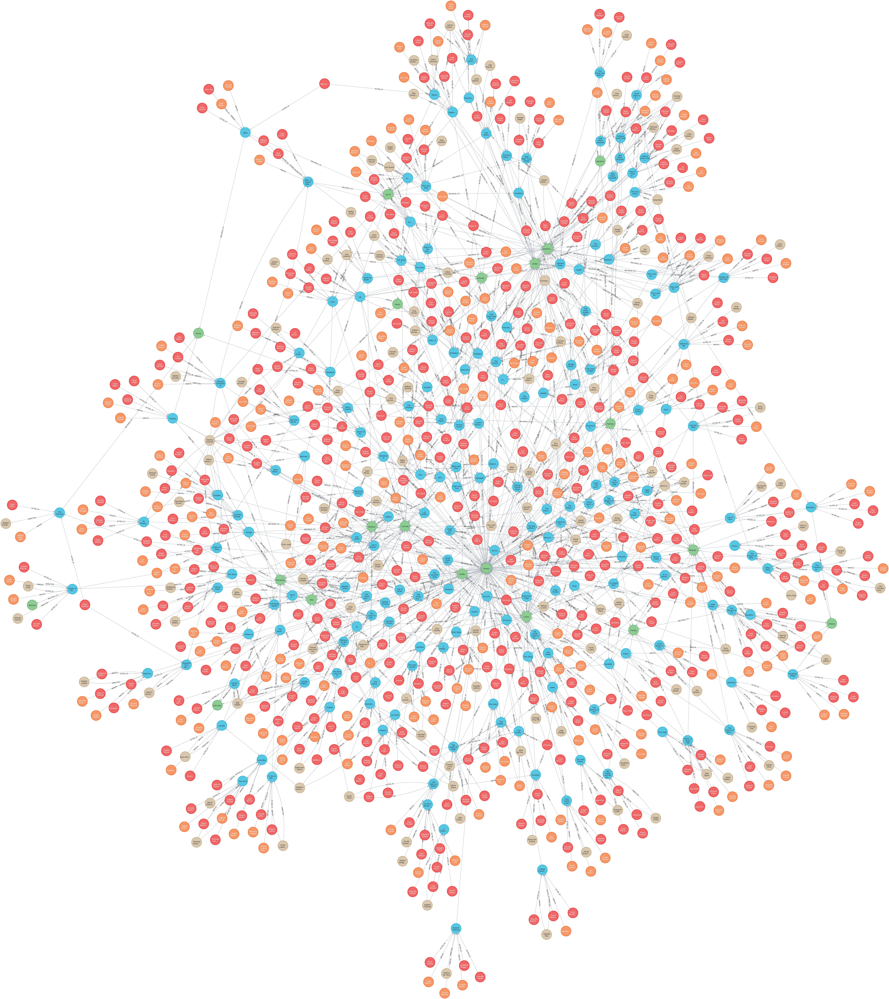
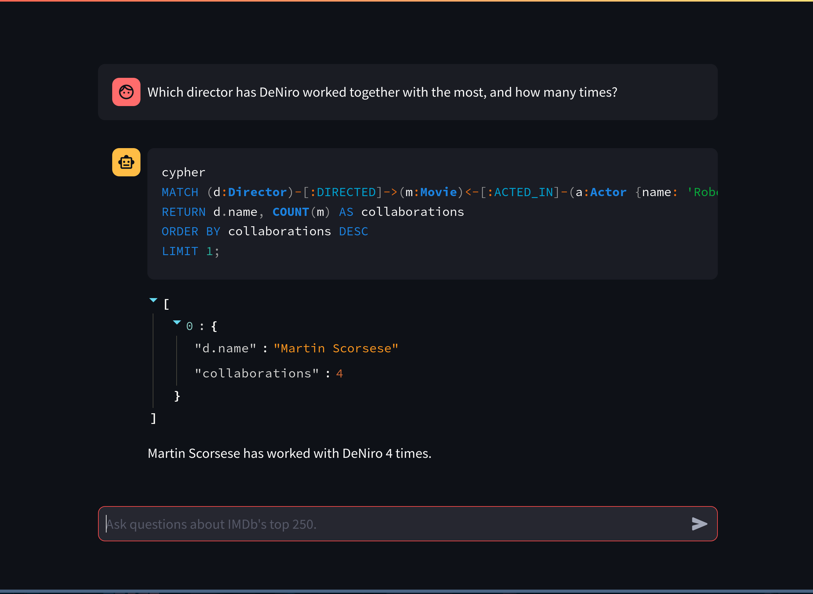

### Simple Knowledge Graph RAG 
    #### Made using Neo4j, Langchain, Gemini API and IMDb Top 250 movies dataset

<div align="center">
    
</div>

- Neo4j database stores the network graph.
    * There are 3 types of nodes - Movie, Genre, Person
    * Person can be - Actor, Director, Writer or a combination of these
    * Relationships are -
        - Person - [ WROTE / ACTED_IN / DIRECTED ] -> Movie
        - Movie - [ BELONGS_TO ] -> Genre
- Langchain and Gemini are used for the pipeline, which 
    * Processes the natural language prompt
    * Generates a query in Cypher
    * Queries the Neo4j database and gets back the response
    * Responds back in natural language

<div align="center">
    
</div>

##### Steps to run -
- Clone the repo and navigate to the diretory.
- Download the 
, rename and move it to the `/data` directory as `imdb.csv`.
- Create a virtual environment, install the requirements, with 1 of the 2 commands
    ```
    conda install -c conda-forge --file requirements.txt
    ```
    ```
    pip install -r requirements
    ```
- Recommended - Create new Neo4j database. ([for Community edition](https://stackoverflow.com/a/62564995))
- Start the Neo4j server.
- Fill in Neo4j credentials and Gemini API key in `.env_template` and rename to `.env`.
- Create the network graph by running the Jupyter notebook `./src/Knowledge_Graph.ipynb`.
- Run the Jupyter notebook `./src/Graph_RAG.ipynb.ipynb`.
- Run the Streamlit web app by running
    ```
    streamlit run ./src/App.py
    ```

##### Credits

